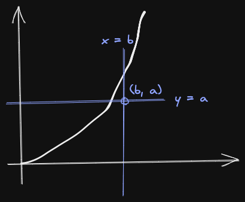

# Young 不等式

### 定理

$$a, b > 0, \frac{1}{p} + \frac{1}{q} = 1$$​ 則：

$$
ab \leq \frac{a^p}{p} + \frac{b^q}{q}
$$

### ​證明

考慮 $$y = x^{p-1}$$​ 和 $$y = x^{q-1}$$​ 的積分（很明顯，他們互為反函數：$$(p-1)(q-1) = 1$$）

直接考慮面積，不等式自然成立。並且，等號成立在 $$a^p = b^q$$​時：

$$
a^{p-1} = b \Leftrightarrow a^p = b^\frac{p-1}{p} = b^q
$$

​
